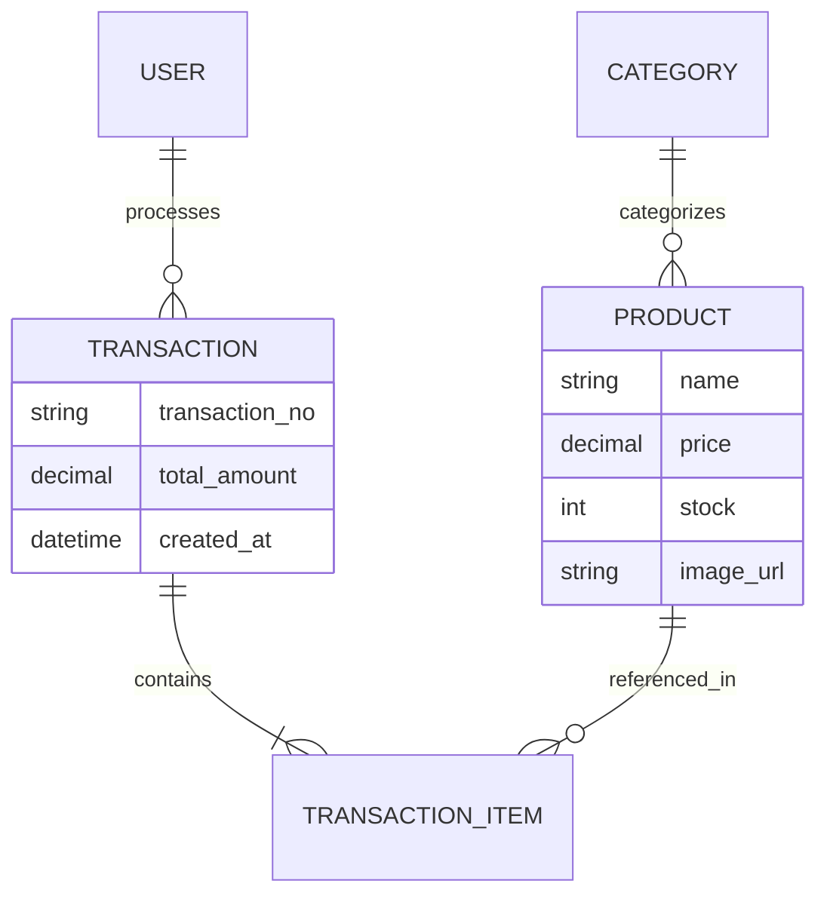

# KasirGo Backend API 🚀

> A robust, secure, and scalable high-performance backend API powering the KasirGo POS mobile application. Built with Django REST Framework and optimized for deployment on Vercel.

[ Link to API Docs / Swagger ]

## 📋 Table of Contents
- [Overview](#-overview)
- [Key Features](#-key-features)
- [Tech Stack](#-tech-stack)
- [Database Schema](#-database-schema)
- [Deployment](#-deployment)
- [Installation](#-installation)

## 📖 Overview
The KasirGo Backend serves as the central nervous system for retail operations. It manages authentication, inventory synchronization, and transaction logging with ACID compliance. It is designed to be **stateless** and efficiently handles concurrent requests from multiple POS terminals.

## ✨ Key Features

### 🔐 Secure Authentication
-   **JWT (JSON Web Token)** implementation (`simplejwt`) for secure, stateless mobile authentication.

### 📦 Inventory Management
-   **Cloudinary Integration**: Automatic optimizations for product image storage and delivery.
-   **Stock Control**: Atomic updates to prevent race conditions during simultaneous checkout.

### 📊 Advanced Reporting
-   **Transaction Searching**: optimized `Q` object filtering for finding transactions by ID, Customer Name, or Notes.
-   **Financial Summaries**: Aggregated data endpoints for daily/monthly sales analysis.

## 🛠 Tech Stack

-   **Framework**: [Django 5.2](https://www.djangoproject.com/) & [Django REST Framework](https://www.django-rest-framework.org/)
-   **Database**: PostgreSQL (Production) / SQLite (Dev)
-   **Storage**: Cloudinary (CDNs for static/media files)
-   **Authentication**: `djangorestframework_simplejwt`
-   **Deployment**: Vercel (Serverless Config) with `whitenoise` for static files.

## 🗄 Database Schema (Simplified)



## 🚀 Deployment (Vercel)

 This project is optimized for **Serverless Deployment**.
 
 1.  **`vercel.json`**: Configured for WSGI application interface.
 2.  **`build_files.sh`**: Custom script to handle migrations and static collection during the build phase.
 3.  **Database**: Connects to external PostgreSQL (e.g., Neon/Supabase) via `dj_database_url`.

## 🏁 Installation

### Prerequisites
-   Python 3.10+
-   PostgreSQL (Optional for local dev)

### Steps

1.  Clone the repo
    ```bash
    git clone https://github.com/yourusername/kasir-go-backend.git
    ```
2.  Create Virtual Environment
    ```bash
    python -m venv venv
    source venv/bin/activate  # Windows: venv\Scripts\activate
    ```
3.  Install Dependencies
    ```bash
    pip install -r requirements.txt
    ```
4.  Run Migrations & Server
    ```bash
    python manage.py migrate
    python manage.py runserver
    ```

---
*Created with ❤️ by [Your Name]*
